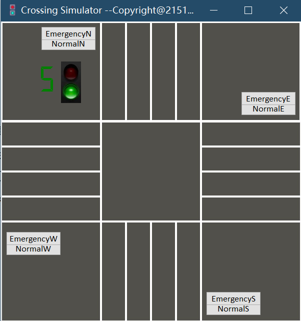
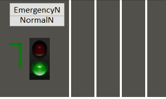
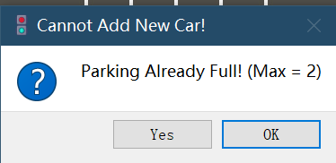
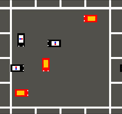
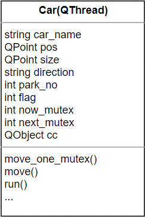
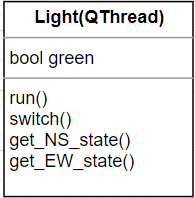

## 处理机管理项目3：

## 	十字路口交通控制

### 项目介绍

#### 项目开发

##### 开发环境

- Windows 10
- Python     3.9.13
- PyQt5       5.15.9

##### 包依赖

- PyQt5

##### 运行方式

1. 双击打包好的 **Crossing.exe** 运行，不需要单独安装PyQt5

2. 安装PyQt5:

   ```
   pip install pyqt5
   ```

   运行程序

   ```
   python Crossing.py
   ```

**注意：** 图片资源文件夹`images` 需要与代码或可执行文件在同一目录下

#### 项目目的

- 熟悉线程/进程同步机制
- 理解信号量机制
- 理解多线程/进程调度
- 体会并理解多线程概念

#### 项目需求

- 模拟出十字路口的交通控制情况，只考虑直行。
- 考虑东、西、南、北四个方向，每条路分为两个车道，每个路口设置一盏显示灯。为简单起见，每种灯显示时间为8秒。
- 当东西（或南北）方向红灯时，所有车辆（除了消防车、救护车、警车）均排队等待，当东西（或南北）方向绿灯时，所有车辆按序行驶（不准超车）。

#### 项目功能

- 显示一个简单的图形化界面，包含车道、十字路口、红绿灯（这里为南北方向）及其剩余时间，红绿灯和倒计时颜色每8秒变换一次。



- 每个方向有两个按钮，点击按钮可以在对应方向生成一辆普通车或警车（代指警车、消防车、急救车等一切无需等红绿灯的车辆）



- 每个方向未进入十字路口的车最多两辆，短时间内在同一方向生成过多车会弹出窗口提示



- 普通车辆红灯时在十字路口前等待，绿灯时才会前进，警车不会遵循信号灯。在十字路口内堵塞时，无论什么车都会等待前方有空位后才继续前进。

  

### 功能实现

采用面向对象的编程思想

#### 信号量`Mutex`

交通路口由四个方向，每个方向来去两条车道组成，可以将交通路口内视为一个4*4的空间，同一时间每个小空间内最多容纳一辆车，即维护一个大小为16的信号量数组来对路口内车辆行进进行管理和分配，当一辆车即将驶入时，将前进方向上一位的信号量-1，驶出后再+1。

```python
class Mutex:  
    '''Crossing Mutex 4*4'''
    mutex = [True for i in range(16)]
```

对于信号量进行`P/V`操作：

```python
def get_mutex(self, point):
    '''set mutex=mutex-1, and return mutex number, similar to P()'''
    try:
        no = self.get_mutex_no(self, point)
        if self.mutex[no] == True:
            self.mutex[no] = False
            print("Mutex No.{} set".format(no))
        	return no            
    except Exception as e:
        print("While get {} mutex: {}".format(point, e))
    return -1
```

```python
 def reset_mutex(self, no):
     '''reset mutex=1, similar to V()'''
     self.mutex[no] = True 
     print("Mutex No.{} reset".format(no))
```

车位类`Park`也用了类似的机制，以确保进入十字路口前的车位只有有限辆车在等待，同时`Park`类还负责在创建一辆车时的定位

```python
class Park:
    ''''''
    # is park available: E1 E2 W1 W2 N1 N2 S1 S2
    park_space = [True for i in range(8)]
    # park position: E1 E2 W1 W2 N1 N2 S1 S2
    park_pos =[QPoint(410, 213), QPoint(410, 263), 
                    QPoint(145, 313), QPoint(145, 363),
                    QPoint(263, 146), QPoint(213, 146),
                    QPoint(363, 413), QPoint(313, 413)]  
    def get_park_mutex(self, direction): ...
    def release_mutex(self, car): ...
```

#### 车和灯线程类

同一时间内有红绿灯的倒计时、切换颜色，和最多约30辆车同时运行，因此设计的车和交通灯线程类继承自`PyQt5`中的`Qthread`类，用信号类`pyqtSignal`和槽函数与主界面UI进行交流以同步UI变化，实现前后端分离，同时也可以解决`python`的`threading`库可能出现的不兼容问题。

类图：



主线程中用列表存储所有车各自的子线程，用字典存储每辆车在主界面UI上对应的`label`

```python
self.car_labels = {}   # save car_name: car_label 
self.car_threads = []  # save car threads
```

车线程内维护一个继承自`QObject`的类对象用于发送创建车辆、移动车辆、销毁车辆的信号：

```python
class CarCommunication(QObject):
    start_signal = pyqtSignal(tuple)
    move_signal = pyqtSignal(tuple)
    end_signal = pyqtSignal(str)
```

车的移动过程分为进入十字路口前、在十字路口内、出十字路口后三个部分，在十字路口内的部分可以看作执行四次“前进一个信号量长度”的过程，每一次要先检查下一个位置的信号量是否为1：如果是，则将其锁定（设为0）并进入该位置，将上一位置复原；如果不是，则等待。

```python
def move(self):
    # before entering the crossing
    self.move_one_mutex(step = 4)  
    # mark move times, 4 times to cross
    move_count = 0

    # only normal car follows traffic light
    if self.flag == 0:
        if self.direction == 'EAST' or self.direction == 'WEST':
            while Light.get_EW_state(Light) == False:
                self.short_pause()
        else:
            while Light.get_NS_state(Light) == False:
                self.short_pause()

   	# no mutex, stop  
    while self.get_next_mutex() == False:
        self.short_pause()

    self.move_one_mutex(50)
    move_count += 1
    Park.release_mutex(Park, self)

    while move_count < 4:
        self.short_pause()

        if self.get_next_mutex() == True:
            self.set_last_mutex()
            self.move_one_mutex(50)
            move_count += 1

    self.set_last_mutex()
    # leave crossing
    while self.is_finished() == False:
        self.move_one_mutex(50)
    self.cc.end_signal.emit(self.car_name)
```

